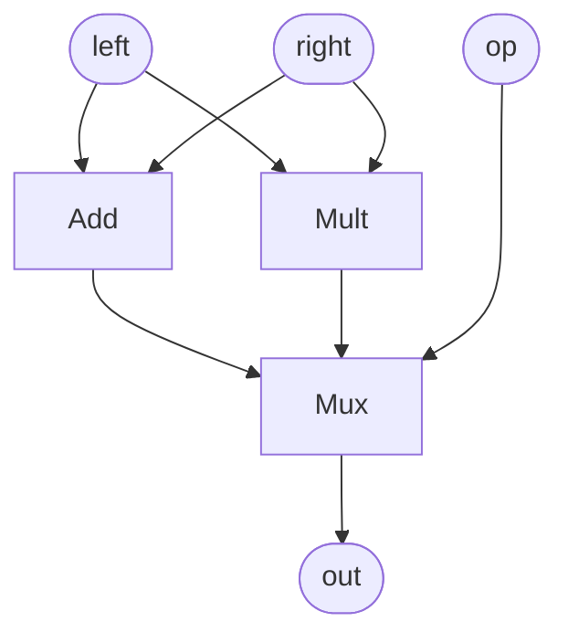

# Hardware Design for the Curious Developer

Filament is a low-level hardware description language. This means that it does not have a lot of primitive constructs and essentially requires us to build up our hardware from scratch. However, Filament's type system helps us build small reusable components and guarantees that composing them generates efficient and correct hardware.

> This tutorial does not assume familiarity with hardware design concepts.

## Building an Arithmetic Logic Unit

Arithmetic Logic Units (ALUs) are a key component of most processors. In a nutshell, they perform various arithmetic operations based on a given op code. We will implement a simple ALU that either performs an addition or multiplication based on the `op` boolean. At a high-level, we want to build a circuit that performs the same computation as this python program:

```python
def alu(op, left, right):
    if op:
        out = left * right
    else:
        out = left + right
    return out
```

The generated hardware will look something like this:


We start by defining a Filament component which wraps all the hardware required to implement some computation:
```filament
{{#include ../../../examples/tut-wrong-1.fil:signature}}
```

The `<G: 1>` syntax defined the event `G` which can be thought of as the "start time" of the component.
We define a module that takes the inputs `op`, `left`, and `right` and produces the output `out`.
Since we're working with hardware, we need to specify the *bitwidth* of each input and output.
Unlike other hardware description languages, Filament *also* requires us to specify exactly when we'll use the input signals and provide the outputs. The syntax `@[G, G+1]` states that the signal must be available in the half-open interval [G, G+1).

Next, we need to perform the computations. Since we're working with hardware designs, we don't get access to primitive operations like `*` and `+`; we must build circuits to perform these computations!

Thankfully, the Filament standard library defines these operations for us, so we can simply import those definitions and instantiate an adder and a multiplier:
```filament
import "primitives/core.fil";       // Defines Add
import "./sequential.fil"; // Defines Mult

comp main<G: 3>(...) -> (...) {
    A := new Add[32];
    M := new Mult[32];
}
```

We define two circuits `A` and `M` which represent a 32-bit adder and a multiplier respectively. The `Add[32]` syntax represents us passing the value 32 for the width parameter of the pre-defined components.

Next, we need to perform the two computations. In Filament, we have to specify the time when a particular computation occurs using an *invocation*:
```filament
    A := new Add[32];
    M := new Mult[32];
    a0 := A<G>(left, right);
    m0 := M<G>(left, right);
```

Here, `a0` and `m0` are invocations of the adder and the multiplier that are performed when the event `G` occurs. We provide values for the input ports of the adder and the multiplier. Finally, we can use a multiplexer to select between the output signals of the two invocations:
```filament
mx := new Mux[32]<G>(op, a0.out, m0.out);
out = mx.out
```

We make use of Filament's combined instance creation and invocation syntax to define a new multiplexer and use it when event `G` occurs. Finally, we forward the output from the multiplexer to the output signal of the component.

Coming from a software background, it might seem weird that we're performing both the computations first and selecting the output after the fact. However, a hardware circuit is *always active*[^clock-gating]–the multiplier and adder are always propagating signals and performing some computation even if the inputs are nonsensical. Furthermore, constructs like `if`-`else` are not compositional.[^control-comp]

The final program looks like this:
```filament
{{#include ../../../examples/tut-wrong-1.fil}}
```

## Checking Timing Behavior

Filament's prime directive is to ensure that your hardware is does not violate temporal constraints.
Let's see what that means exactly by trying to compile our program.
Save the file as `alu.fil` and run the following command from the Filament repository:
```
cargo run -- alu.fil
```

Filament tells us that the program is incorrect:
```filament
{{#include ../../../examples/tut-wrong-1.expect:4:}}
```

Filament is telling us that our multiplexer expects its input during the interval [G, G+1) but the multiplier's output is only available in the interval [G+2, G+3).
What went wrong? We started our adder and the multiplier at the same time (when event `G` occurs) but the multiplier seems to take longer.
This is because multipliers are fundamentally different from adders–they require a lot more hardware and a lot more time to perform their computation.
This *temporal constraint*–that multiplier may take several cycles while adders may not–is checked by Filament to ensure that our resulting hardware only reads meaningful values.

In order to fix this, we need to execute the multiplexer when the signal from the multiplier is available. However, in that case, we won't have access to the signal from the adder which only provides its output in the interval [G, G+1). We need to somehow make the signal from the adder last longer as well.

## Saving Values for the Future

Registers are the primitive stateful building block for hardware designs and can extend the availability of signals. The signature of a register is complicated but interesting:
```filament
{{#include ../../../primitives/state.fil:register}}
```

Notice the availability of the `out` signal: it is available in the interval [G, L) where `L` is provided to the component during its invocation.
This means that a register can hold onto a value for as long as needed!
The additional `where` clause ensures that `out`'s interval is well-formed; it would be troublesome if we could say that `out` is available between [G+10, G+5).

Let's try to fix our program by making changes:
```filament
{{#include ../../../examples/tut-wrong-2.fil}}
```
We made a couple of changes to our program:
- Run the multiplexer when the output from the multiplier is available (at `G+2`).
- Save the value from the adder in the register invocation `r0`
- Use the value from the register instead of the adder for multiplexing.


Sadly, Filament is still angry at us:
```
{{#include ../../../examples/tut-wrong-2.expect:4:}}
```

The problem is that we accept the `op` input and produce the output `out` in the interval [G, G+1). However, we know that it is not possible to produce the output as soon as we get the input because the multiplier takes two cycles to produce its output!

## A Correct Implementation

The fix is easy: we change the signature of the ALU to reflect this cruel reality
```filament
{{#include ../../../examples/tut-seq.fil}}
```

And running the compiler again no longer generates any errors:
```
cargo run -- alu.fil
```


[^clock-gating]: This is not quite true since we can build circuits where the clock signal to a particular sub-circuit is disabled (or "gated") based on a particular signal. However, this kind of clock-gating is generally not recommended for fine-grained usage.

[^control-comp]: While control operators like `if` and `for` are supported in languages like Verilog, they don't quite work the same in all contexts. `for` loops are compile-time constructs whereas `if` can only be used for combinational circuits like adders but not multipliers.
