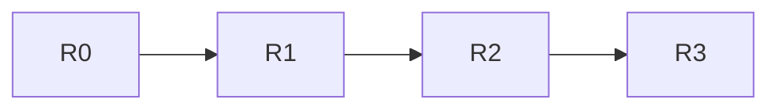

# Loops and Bundles

Much like rest of Filament, generative programs in Filament need to be *safe*, i.e., correctly pipelined.
We'll learn about two features in Filament that help us write safe programs: `for`eloops and `bundle`s which help us write safe and efficient hardware modules.

Our running example will be a *shift register*.
A shift register is a linear chain of registers that forward their values every cycle:


Our goal is to build a *parameterizable* shift register which takes some value `N` and builds a chain of `N` registers.
The first order of business is to define the interface of the shift register.

```filament
comp Shift[#N](
    @[G, G+1] input: 32
) -> (@[G+#N, G+#N+1] out: 32);
```

Notice that we accept an input in the first cycle, `[G, G+1)`, and is produced `N` cycles later in `[G+#N, G+#N+1)`.
For the implementation, we'd like to use a `for` loop to build up a chain of registers.
Here is some python pseudocode for how we might do this:
```python
# Initial output is just the input
cur_out = input
for i in range(0, N):
    # Build a new register and connect
    # its input to the previous output
    new_reg = Register(32)
    new_reg.input = cur_out
    # Update the current register and output
    cur_out = new_reg.out
# Output the final value
out = cur_out
```

### Bundles

While straightforward, this code is hard for Filament to check: it does not understand when each register is used relative to the module's start time.
We'll use a `bundle` to help Filament understand how the output signals from the register are used.
A `bundle` is a sized array with a type describing when the values in the bundle are available:
```filament
bundle f[#N]: for<#i> @[G+#i, G+#i+1] 32
```

This defines a bundle `f` with `N`.
The type for the bundle states that the value at index `i` in the bundle is available in the interval `[G+i, G+i+1)`.
For example, the value at `f{0}` is available at `[G, G+1)`, `f{1}` is available at `[G+1, G+2)`, and so on.
Intuitively, each index in the bundle represents the input to a register in the shift register chain.

### Loops

Filament loops are nothing special: they simply allow you to iterate over a numeric range:
```filament
for #i in s..e {
    <body>
}
```

This defines a loop where the value of `#i` ranges from `s` to `e` (exclusive).

## Implementation

Using these two operations, we can implement a shift register.
The following implementation is parameteric both over the width of the register and the number of registers in the chain:
```filament
{{#include ../../../primitives/state.fil:shift}}
```